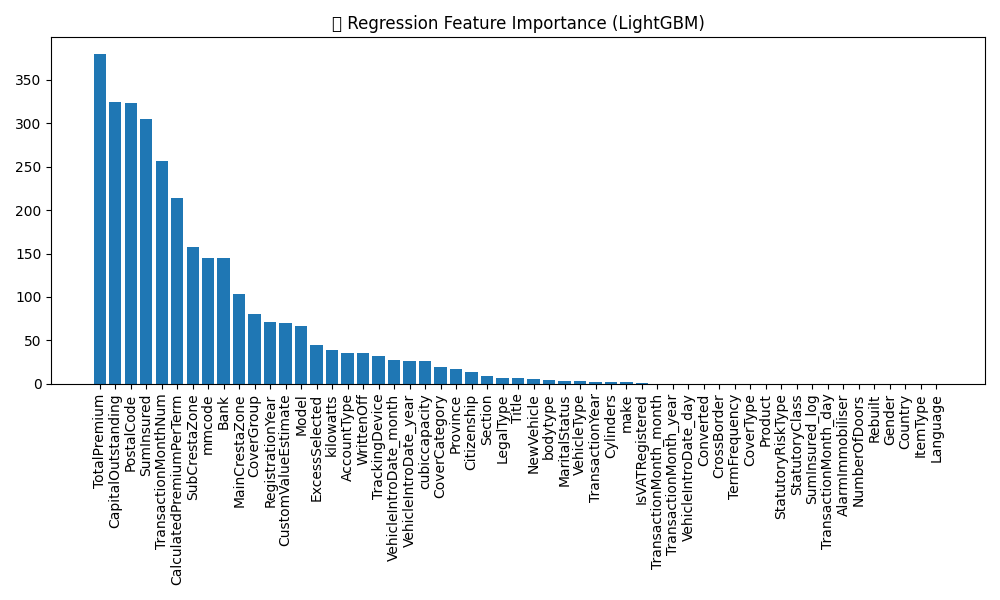
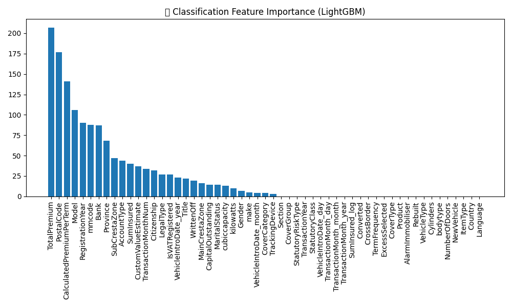
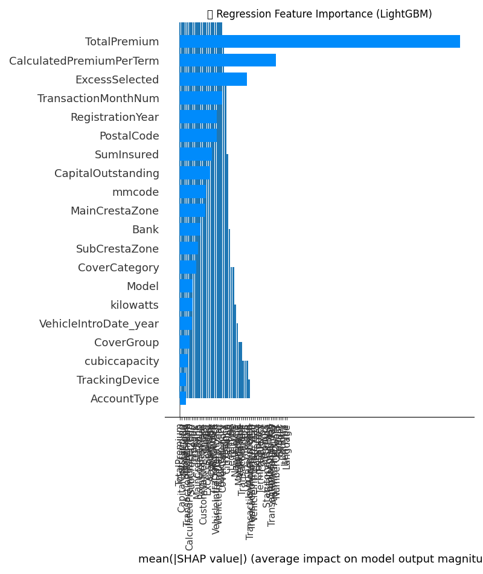

# Task 4 Summary: Predictive Modeling & Interpretability

## 1. Objectives
- Build a **claim severity** model to predict total claim amount for policies with claims.
- Build a **premium tiering** model to classify policies into high vs. low premium segments.
- Evaluate models with appropriate metrics.
- Understand driving features via SHAP.

---

## 2. Data Preparation
- Filtered and imputed missing values.
- Engineered date features (year, month, day).
- Encoded categoricals (label encoding).
- Binarized `TotalPremium` at median to create `is_high_premium`.

---

## 3. Modeling & Evaluation

| Model                   | Algorithm    | Metric 1        | Metric 2        | Top Feature    |
|-------------------------|--------------|-----------------|-----------------|----------------|
| Claim Severity          | LightGBM Regr| RMSE: 2,961.85  | R²: –0.05       | IntroYear      |
| Premium Tiering         | LightGBM Clf | Accuracy: 1.00  | F1-Score: 1.00  | SumInsured     |

---

## 4. Feature Importance
  
_Figure 1: Top 10 features driving claim severity._

  
_Figure 2: Top 10 features driving premium tiering._

---

## 5. SHAP Interpretability
  
_Figure 3: SHAP summary for claim severity (sampled 10%)._

  
_Figure 4: SHAP summary for premium tiering (sampled 10%)._

---

## 6. Business Recommendations
1. **Depreciation loading:** Increase weight on vehicle age in premium calculations.  
2. **Insured value bands:** Refine premium tiers around sum insured thresholds identified by the classifier.  
3. **Continuous Improvement:** Explore additional features (e.g., driver age, credit score) to improve R² for claim severity.

---

## 7. Next Steps
- Hyperparameter tuning (Grid/Random search).  
- Incorporate LIME for local explanations on key outliers.  
- Build an automated pipeline for model retraining and deployment with DVC integration.

